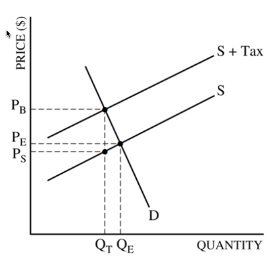

# Question 1 (b)

  

# Question 2 (b)

  -  For a company in a perfectly competitive factor market, the
     marginal factor cost for the company equal to the equilibrium wage
     on the market because the company is a wage taker and the market
     sets the wage.

# Question 2 (c)

  -  The value of the marginal product of a factor is the **value** of
     the **additional output** generated by employing **one more** unit
     of that **factor**.
    
      -  VMPL = Value of the Marginal Product of Labor
    
      -  MRP = Marginal Revenue Product

  -  Hiring decision rule
    
      -  Hire the extra worker if VMPL \>W
    
      -  **VMPL = W** at the profit-maximizing level of employment

  

  -  This curve shows how the **value of marginal product of labor**
     depends on the **number of workers** employed.

  -  It slopes **downward** because of diminishing returns to labor in
     production

  -  To maximize profit, you should choose the level of employment at
     which the value of the **marginal product of labor** is equal to
     the **market wage** rate

# Question 3 (b)

  -  The after-tax price received by sellers: intersection of
     QT(Quantity produced after tax imposed) and S

  

# Question 3 (d)

  -  The tax burden will fall more on buyers and less on sellers
     because the demand curve is more inelastic than the supply curve.

  
  
  
  
  